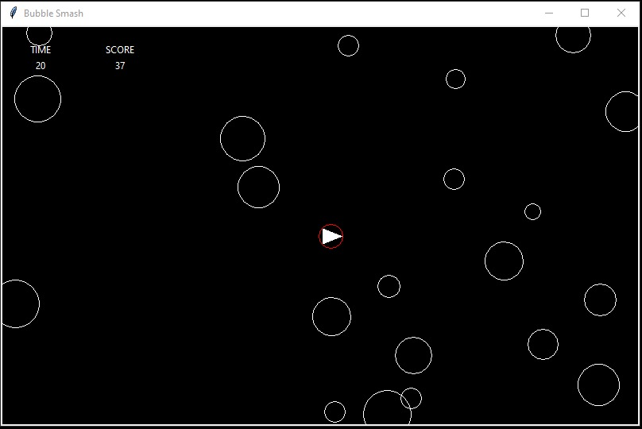
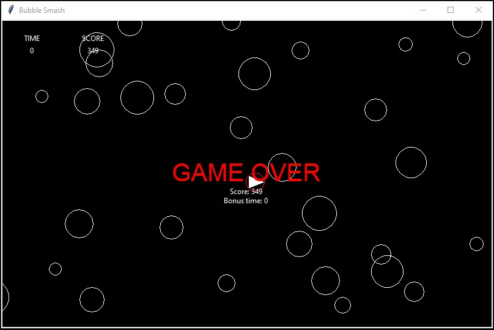

# Bubble Smash

Bubble Smash is a simple and fun game where the goal is to pop as many bubbles as you can within the given time. The game keeps track of your score, and you can challenge yourself to beat your high score with each play.

## How to Play

- Click on the bubbles to pop them.
- Each bubble you pop will increase your score.
- You have a limited amount of time to pop as many bubbles as possible.
- Try to get the highest score before the time runs out!

## Game Screenshots

In-Game Screenshot

Game Over Screenshot

## Installation

To play Bubble Smash, simply download and run the executable file provided. No additional installation steps are required.

## License

This game is provided as-is and is free to play. Feel free to share it with friends and family.

Enjoy popping bubbles and have fun!
